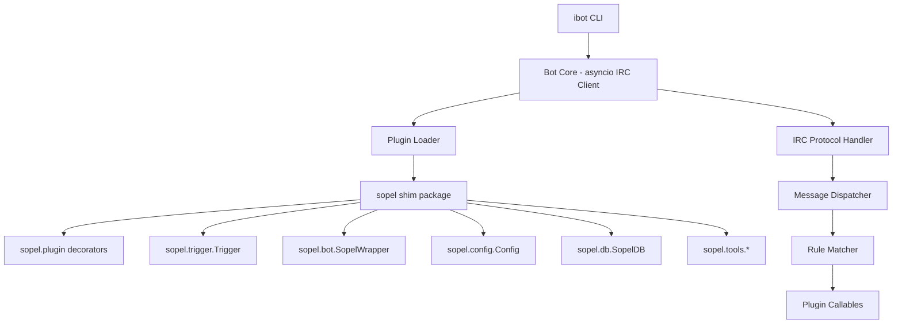

# ibot - Sopel-Compatible IRC Bot

## Overview

Build an IRC bot from scratch (using Python's `asyncio` + raw sockets) that provides a **Sopel-compatible API shim** so existing Sopel plugins (`.py` scripts using `from sopel import plugin`) can run with **minimal or no modifications**.

## Architecture



## Module Structure

```
ibot/
├── __init__.py
├── __main__.py              # Entry point
├── bot.py                   # Core IRC client (asyncio)
├── config.py                # Config file parser (INI format)
├── loader.py                # Plugin discovery & loading
├── dispatch.py              # Message dispatch & rule matching
├── sopel_shim/              # Drop-in `sopel` package replacement
│   ├── __init__.py
│   ├── plugin.py            # All decorators: command, rule, event, etc.
│   ├── module.py            # Legacy alias for plugin.py
│   ├── trigger.py           # Trigger & PreTrigger classes
│   ├── bot.py               # SopelWrapper (the `bot` arg plugins receive)
│   ├── config/
│   │   ├── __init__.py      # Config class
│   │   └── core_section.py  # [core] section definition
│   ├── db.py                # SopelDB (SQLite)
│   ├── tools/
│   │   ├── __init__.py      # SopelMemory, Identifier, etc.
│   │   ├── time.py          # Time utilities
│   │   └── web.py           # URL search utility
│   ├── formatting.py        # IRC color/formatting codes
│   └── privileges.py        # AccessLevel constants
├── plugins/                  # User plugin directory (loaded at runtime)
│   └── example.py
└── default.cfg              # Example config file
```

## Key Components

### 1. Core IRC Client (`bot.py`)
- asyncio-based TCP/SSL connection
- IRC protocol: NICK, USER, JOIN, PING/PONG, PRIVMSG, NOTICE, MODE, etc.
- SASL PLAIN authentication support
- Auto-reconnect with backoff
- Flood protection (message throttling)

### 2. Sopel Shim (`sopel_shim/`)
The shim is installed as `sopel` on `sys.path` so `from sopel import plugin` works.

#### Decorators (`plugin.py`)
- `@plugin.command(*names)` - prefix commands
- `@plugin.rule(*patterns)` - regex rules  
- `@plugin.event(*events)` - IRC event handlers
- `@plugin.nickname_command(*names)` - "BotNick: command" style
- `@plugin.action_command(*names)` - CTCP ACTION triggers
- `@plugin.require_admin` / `require_owner` / `require_chanmsg` / `require_privmsg`
- `@plugin.require_privilege(level)` 
- `@plugin.rate(user, channel, server)`
- `@plugin.interval(seconds)` - periodic tasks
- `@plugin.unblockable`, `@plugin.thread`, `@plugin.priority`
- `@plugin.example`, `@plugin.output_prefix`
- Privilege constants: `VOICE`, `HALFOP`, `OP`, `ADMIN`, `OWNER`

#### Trigger (`trigger.py`)
- Subclass of `str` (the message text)
- Properties: `nick`, `sender`, `host`, `user`, `hostmask`, `event`
- Properties: `match`, `group`, `groups`, `groupdict`
- Properties: `args`, `tags`, `time`, `admin`, `owner`, `account`
- Properties: `is_privmsg`, `raw`, `plain`, `urls`, `ctcp`

#### Bot Wrapper (`bot.py`)
- `bot.say(text, destination=None)`
- `bot.reply(text, destination=None, reply_to=None)` 
- `bot.notice(text, destination=None)`
- `bot.action(text, destination=None)`
- `bot.kick(nick, channel=None, text=None)`
- `bot.nick` - bot's current nick
- `bot.settings` / `bot.config` - config access
- `bot.db` - database access
- `bot.memory` - SopelMemory dict
- `bot.channels` - channel tracking
- `bot.users` - user tracking

#### Database (`db.py`)
- SQLite-backed
- `get/set_nick_value(nick, key, default=None)`
- `get/set_channel_value(channel, key, default=None)`
- `get/set_plugin_value(plugin, key, default=None)`
- `delete_nick_value`, `delete_channel_value`, `delete_plugin_value`

### 3. Plugin Loader (`loader.py`)
- Scan plugins directory for `.py` files
- Inject shim into `sys.modules` as `sopel`
- Import each plugin module
- Extract decorated callables, setup/shutdown hooks
- Register with dispatcher

### 4. Message Dispatcher (`dispatch.py`)
- Parse incoming IRC lines into PreTrigger
- Match against registered rules (commands, regex, events)
- Create Trigger with match object
- Create SopelWrapper with context
- Call plugin functions in threads (default) or main thread
- Rate limiting enforcement

## Config Format

Compatible with Sopel's INI-style:

```ini
[core]
nick = mybot
host = irc.libera.chat
port = 6697
use_ssl = true
owner = yournick
channels = #channel1, #channel2
prefix = .
auth_method = sasl
auth_user = mybot
auth_password = secret123
db_filename = ibot.db

[admin]
admins = admin1, admin2
```

## Implementation Order

1. **Phase 1**: Sopel shim package + decorators (so plugins can import)
2. **Phase 2**: IRC client core (connect, send, receive)  
3. **Phase 3**: Plugin loader + dispatcher
4. **Phase 4**: Trigger + Bot wrapper (full API)
5. **Phase 5**: Database + config
6. **Phase 6**: Advanced features (rate limiting, SASL, scheduling)
